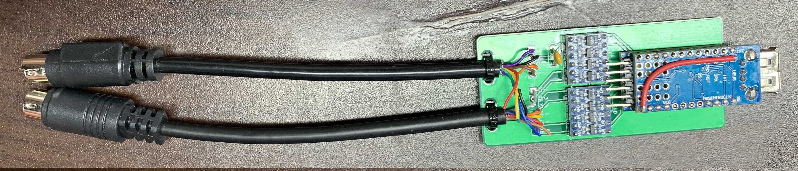
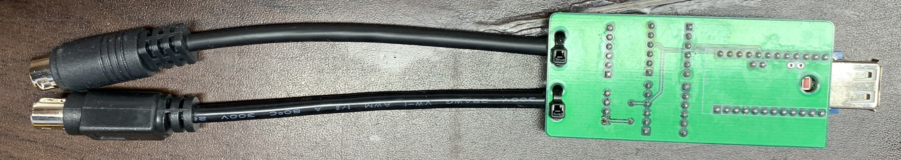
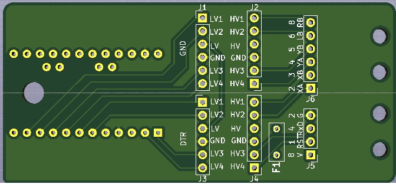
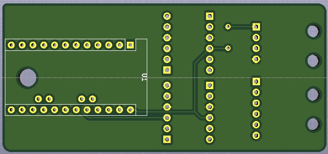
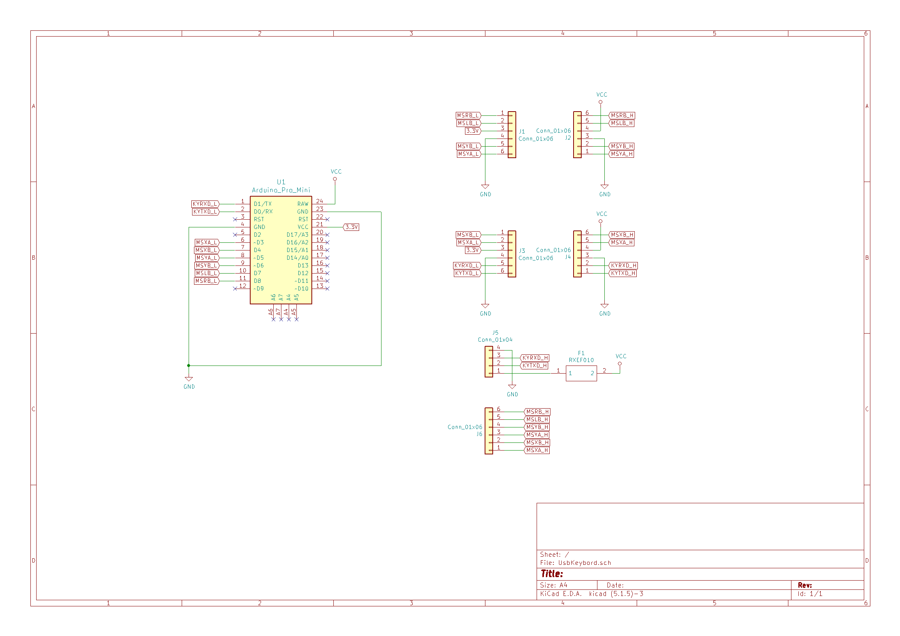
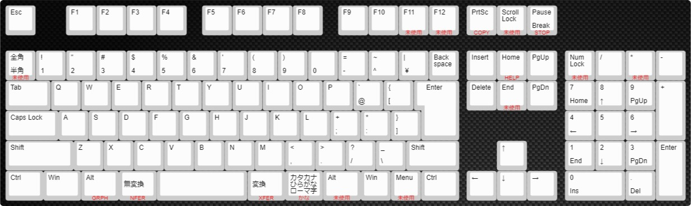
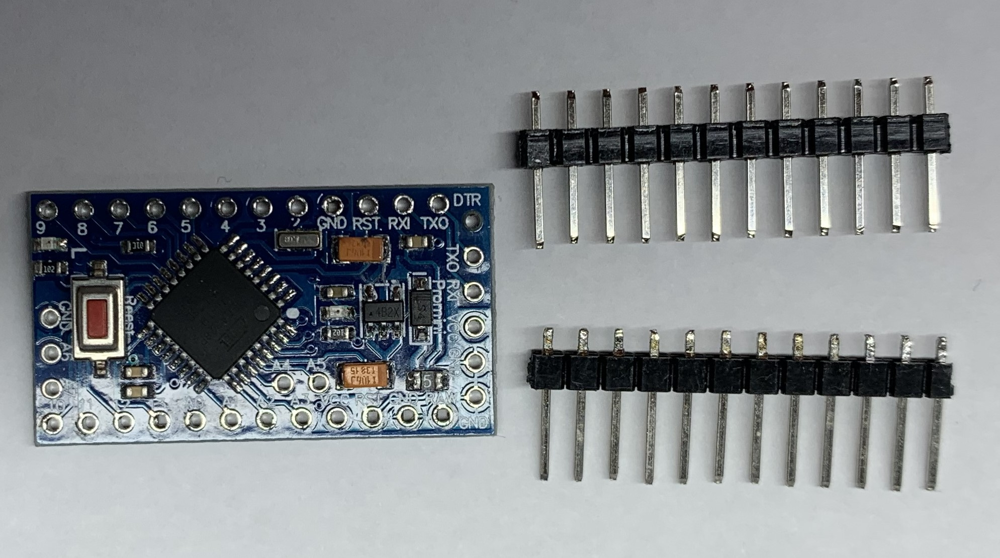
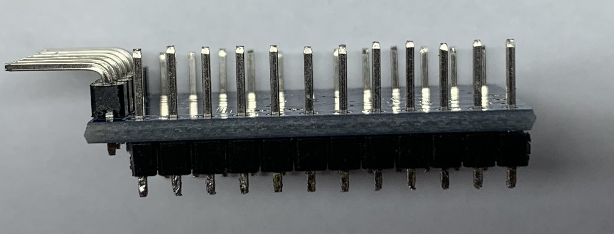
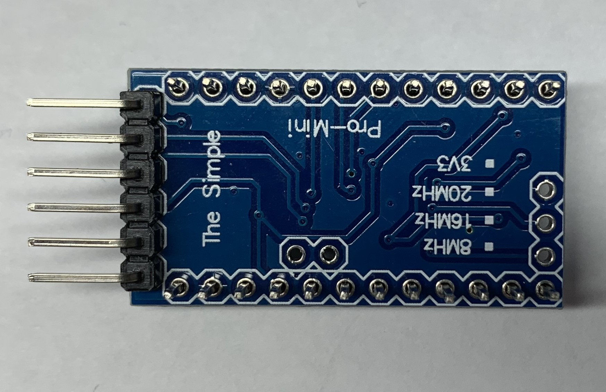
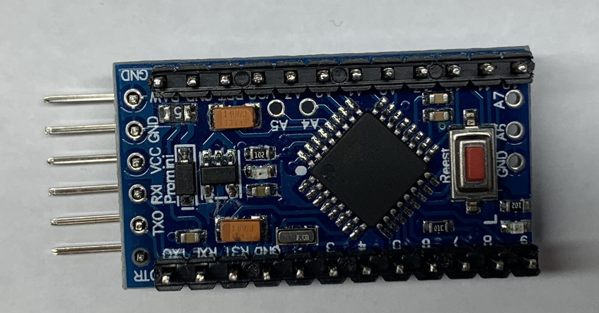

# USBKBD2PC98

USBKBD2PC98 とは USBキーボードをPC98で使えるようにしたものです。

## 注意
全てのUSB機器に対して稼働確認が取れているわけではありません。
相性等動かないものもありますのでご了承ください。
また、ゲーミングキーボード等電力を多く使用するものも使用できません
※確認はPC9821AP2のみです

## 完成品

## ガーバーデータ

## 配線図

## キーアサイン
日本語109キーボードアサイン例 `赤字部分がPC98のキーアサイン`

## Setup
* PlatformIO を使用しています。
 ライブラリとしてUSB_Host_Shield_2.0 を使用しています。
  (https://github.com/felis/USB_Host_Shield_2.0) 
 ライブラリとしてMsTimer2 を使用しています。
  (http://playground.arduino.cc/Main/MsTimer2)

## 部品リスト
* arduino pro mini(3.3v) 一個
 https://www.amazon.co.jp/waves-Arduino-Mini-%E4%BA%92%E6%8F%9B%E3%83%9C%E3%83%BC%E3%83%89-ATmega328P-AU/dp/B07MZSHDCQ/ref=sr_1_1?crid=1T8T3ELJD9ZDK&dib=eyJ2IjoiMSJ9.U2GPDj09_x6wBjCog7rzMUINEV_OwrxzAdvVwxhpYU_otTz_gWy5bxKM8KNp0dCeDzAyvFHRRLWGgfYLxFCYlW7g4zCVBLpae1IwQAUsQbcPp0ru0kcMJuEwx6i7Jvu17igyza8hVJrWdHhNhmVKhxV5grMx-HihhQC6LIAVrSZ70fp2Fohs4_4AeoYBRGeHaX_qSCGNQPdgj9_lkrE_QY5wQEirdceg-hQJKPt719UZYpXSE8jezRxlUZUhHGTmjrZRKdmkNkaTeyLvn4YEXxdtSQD6nGGxlFgfKOoo3AU.aooVLbpR97U-fvO5aaKJFXAoqj_rrPer9BR9023KRo0&dib_tag=se&keywords=arduino+pro+mini+3.3v&qid=1715095787&sprefix=arduino+pro+mini%2Caps%2C205&sr=8-1
* ミニusbホストシールド2.0 一個
 https://www.amazon.co.jp/gp/product/B074HTPK13/ref=ppx_yo_dt_b_asin_title_o00_s00?ie=UTF8&psc=1
* レベル変換 二個
 https://www.amazon.co.jp/gp/product/B014F8ZEVM/ref=ppx_yo_dt_b_asin_title_o01_s00?ie=UTF8&psc=1
* Minidin 8p 一個
 https://www.amazon.co.jp/%E3%83%9E%E3%83%AB%E4%BF%A1%E7%84%A1%E7%B7%9A%E9%9B%BB%E6%A9%9F-%E3%83%9F%E3%83%8BDIN%E3%83%97%E3%83%A9%E3%82%B0-8P/dp/B074BZ2KY5/ref=sr_1_23?__mk_ja_JP=%E3%82%AB%E3%82%BF%E3%82%AB%E3%83%8A&crid=3B0XCE423UJC&dib=eyJ2IjoiMSJ9.OcTgX2InY2VJq6T6l9ZeRjQFgA0-yR8y-NOsnhGIEApOSaRnUCAAr2nQr7o6n3G8spKzf3xZ5TzSBwkezNJbv7FPY3TZY76mKDpky-Lgk7rzDOl5m7LPW4LkGh2RsplDv6GsPR0huT6c3XH3XRI-1wL5c691UGv8QwuGALzvxOFFWKn_BjDn1T45RwnOqLNkFBatp_ivMV9t3wX5Bo38I3VWNa0IbQB7NWWAK3CeasqFQ5ddnPYYX87I1fwjN14NE1zUaQaNvsbyCkSexX2NcFqIjOYSg1VVxTPSqZYaCaU.wdwKvO1oCmREyO0EIxY2lklpqUiJpUFvJWrpYXwrFyM&dib_tag=se&keywords=mini+din+8p&qid=1715096088&sprefix=minidin+8p%2Caps%2C183&sr=8-23
 ※配線済みの方が作業がしやすいかもしれません
* Minidin 9p 一個
 https://www.amazon.co.jp/%E3%83%9E%E3%83%AB%E4%BF%A1%E7%84%A1%E7%B7%9A%E9%9B%BB%E6%A9%9F-%E3%83%9F%E3%83%8BDIN%E3%83%97%E3%83%A9%E3%82%B0-9P/dp/B074C7T7YR/ref=sr_1_10?__mk_ja_JP=%E3%82%AB%E3%82%BF%E3%82%AB%E3%83%8A&crid=10QB8BB3LFONF&dib=eyJ2IjoiMSJ9.8Jfba93vgC5RO4NFur4oNVvGYrZ06iSkPY3B_qn7xCjnpYbtZHgWyhrBW8rIoP6WKwW807J2fenzTVFCNqoTeyvlPFKV7jSnOv7eXLVe0uoy0YXSzOJCEsujJ6GZGRHrqC3fDciOFCYpRRRg-3fCqYmLFoINrJTa1N8bUwO4iXQMXDEKDr_tFqQUpE5nKHT1hFFv1i_ZMdXr2YryBptUYhN7NJrBRjF0LtShSfDGgJ_Rkt24vP2syOr0yHNiY_qnLaik9j1b61MvPcFEDkJW3_k0gam--urfLqm43NdyUb0.6DFeX-mDg6RMYU5JjHBYlqGz6NqQVfjoDDA-LQOpc3s&dib_tag=se&keywords=mini+din+9p+1%E5%80%8B&qid=1715096127&sprefix=minidin+9p+%E4%B8%80%E5%80%8B%2Caps%2C182&sr=8-10
 ※配線済みの方が作業がしやすいかもしれません
* リセットヒューズ 一個
 ※PC98のキーボードの定格がわからないので200,300mAのものでよいと思います

## 作成方法
* ミニusbホストシールド2.0の5V改造
 ミニusbホストシールド2.0はUSB電源が3.3Vになっているので5Vになるようにします。 
 また、RAWに5V供給すればarduino pro mini(3.3v)はレギュレーターで3.3Vで駆動します 
 方法は以下 
 VBUS パターンカット（赤丸部分） 

* USBKBD2PC98基板とarduino pro mini 3.3vの結合準備
 Arduinoに添付した PIN に3枚の基板を半田付けするのでプラスティックをちょっと端に寄せます。 
 Arduinoは基板と逆方向にはんだ付けするので書き込み用のpinも逆につけます。 

* USBKBD2PC98基板とarduino pro mini 3.3vの結合
 USBKBD2PC98基板に上記で準備したarduino pro mini 3.3vを結合します。 
 ※半田はすべてのPINに対して行ってください 

* USBKBD2PC98基板とミニusbホストシールド2.0の結合
 USBKBD2PC98基板に上記で準備したミニusbホストシールド2.0を結合します。 
 ※半田はすべてのPINもしくは画像の部分のみに対して行ってください 

* ミニusbホストシールド2.0に5V供給線の結合
 ミニusbホストシールド2.0に5V供給線を結合します 
 ※半田は画像の線部分 

* レベル変換、リセットヒューズの結合
 USBKBD2PC98基板にレベル変換とリセットヒューズを結合します 
 ※ケーブル側がHV、arduino pro mini 3.3v側がLVとなります。 
 
* Minidin 8p、Minidin 9pの結合
 USBKBD2PC98基板にMinidin 8p、Minidin 9pを結合します 
 minidin8P 
   1 RST 
   2 GND 
   4 RxD 
   8 Vcc(+5V) 
 minidin9P 
   2 XA 
   3 XB 
   4 YA 
   5 YB 
   6 L 
   8 R 
   
* プログラムの書き込み
 PlatformIOにてプログラムを書きこんでください 
